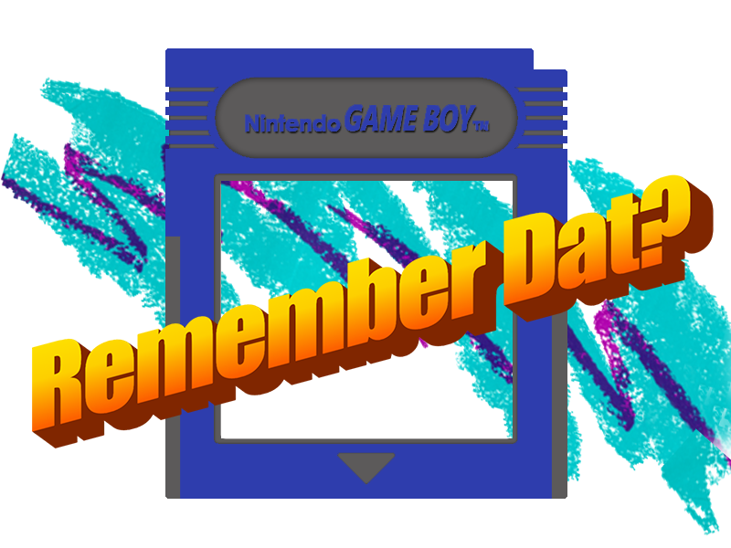

# rememberDat?

A website that brings you back to the simpler times.

## Description

RememberDat is a Nostalgia engine that generates sweet, sweet dopamine through memories and media. Users will get a “blast from the past” through music, news articles, photos/memes, games, and aesthetic UI. This is a fullstack application hosted on Heroku.

[Live Demo](https://remember-dat.herokuapp.com/)

## User Story

```
GIVEN that I want an Escape from these troubling times
and want to get a blast from the past
I WANT to see stuff that reminds me 90s Pop Culture
SO THAT I can remember how far Technology and UI has come over the last 30 years.
```

## Functionality

```
WHEN I create my rememberDat account
THEN I am given a list of categories to choose from
WHEN I select my topic I am able to get my dopamine dose of the good ol' days.
THROUGH APIs and features that deliver curated 90s era content.
```

## Screenshots

Your Journey begins here:


<!-- When I Click to begin my journey:
_Insert Create a Account Page_ -->

<!--I am prompted with options:
Insert Categories Page_-->

<!--And the Topic I picked, shows me various content relating to it:
_Insert Example of a Topic when it is clicked_-->

## Packages, APIs, and Technologies used:

### Packages

This Project uses Express, Travis-CI, Handlebars, Sequelize, Eslint, and Passport.

### APIs

APIs from Bing, Pinterest, and UrbanDictionary.

# Credits

## The rememberDat? Nostalgia Task Force:

[Mike Vitelli](https://github.com/mikevitelli)

[Karen Kaltenheuser](https://github.com/kkaltenheuser)

[Dante Ivec](https://github.com/rrrossettiii)

[Travion Francis](https://github.com/travionfrancis)

[Jay Idrees](https://github.com/jidrees)

## Installation Instructions

- You must first have Node installed on your computer
- Clone the repository
- Install the required packages with `npm install`
- Run `nodemon watch`

## License

This project is licensed under the MIT license.


## Contributions

Submit a PR documenting any proposed additons, and we'll reach out!
